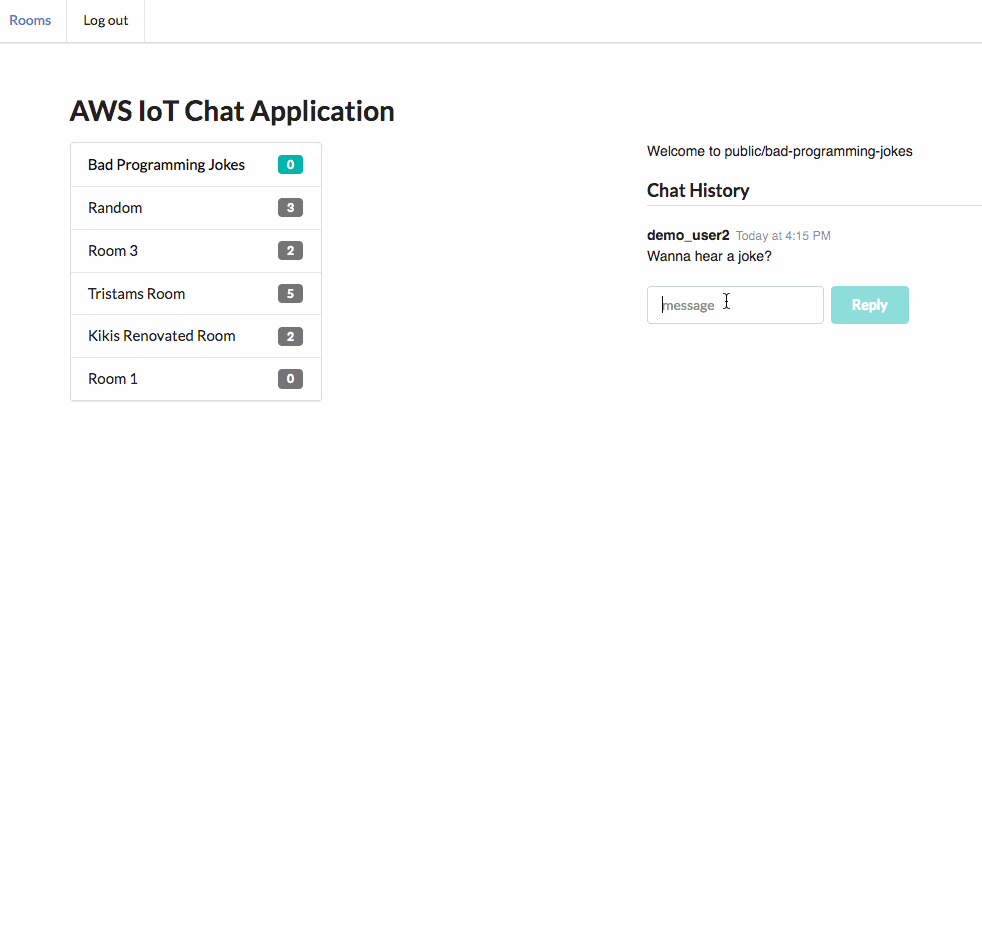
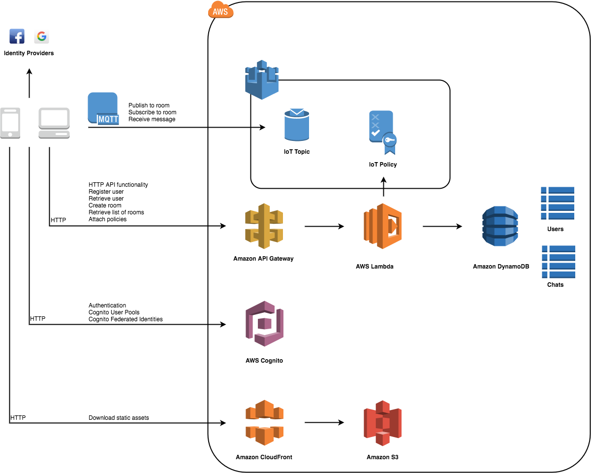
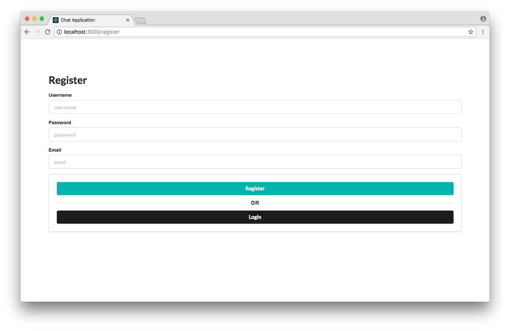
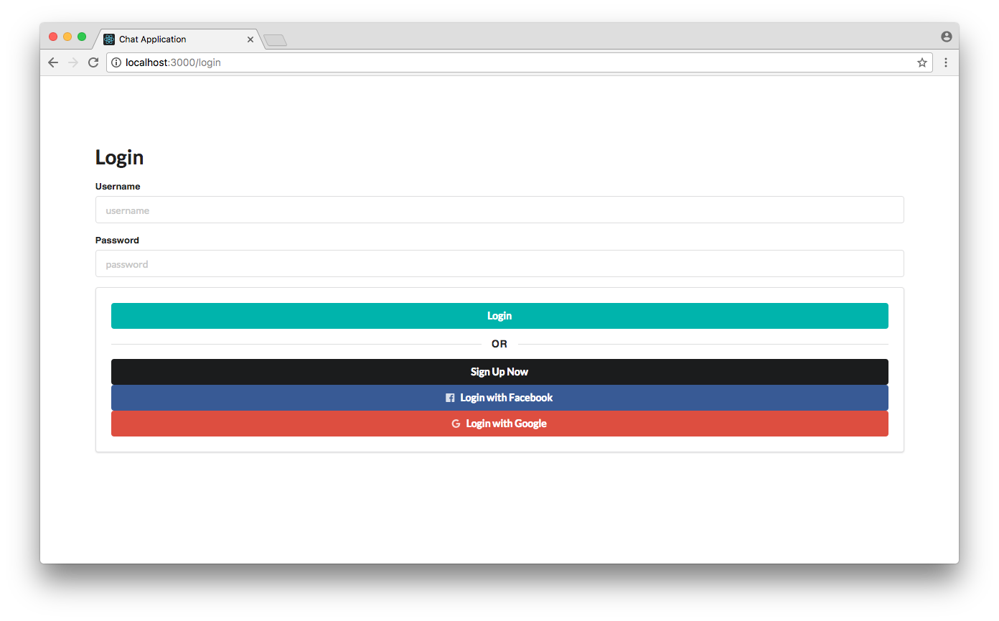
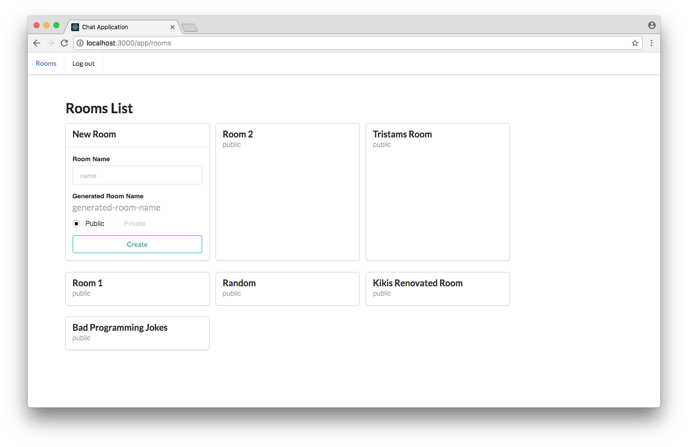
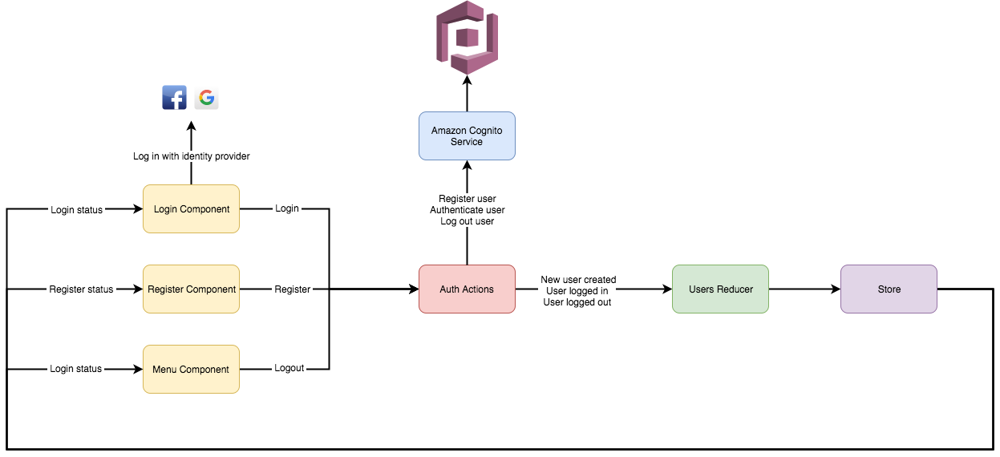
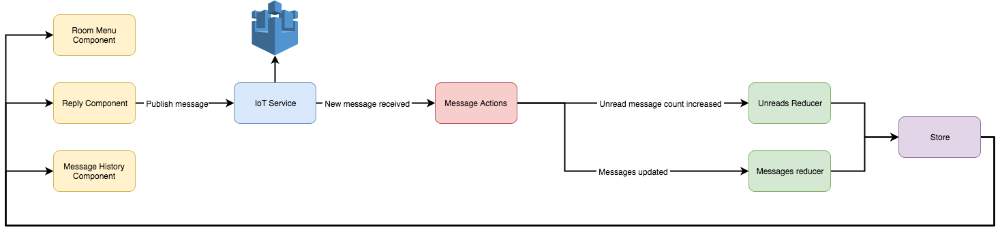
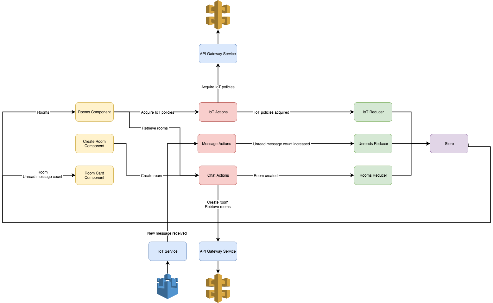

# AWS IoT Chat Application

[](https://github.com/facebook/jest)
[](https://github.com/awslabs/aws-iot-chat-example/stargazers)
[](https://github.com/awslabs/aws-iot-chat-example)
[](https://d2ab9cgiumpbb1.cloudfront.net)

This is a React application demonstrating how to use the AWS IoT platform via MQTT over the WebSocket protocol to build a **live chat application**. The sample application serves as a starting point for users to build serverless projects with Amazon Cognito, AWS Lambda and Amazon DynamoDB. The project showcases the solution to common user questions such as how to authenticate IoT devices with Amazon Cognito.



## Table of Contents

* [Features](#features)
* [AWS Services Showcased](#aws-services-showcased)
* [Installation](#installation)
* [Application Walkthrough](#application-walkthrough)
* [Architecture Walkthrough](#architecture-walkthrough)
   * [Frontend](#frontend)
      * [Redux Flows](#redux-flows)
   * [Backend](#backend)
      * [IoT Topics](#iot-topics)
      * [Other guides](#other-guides)
* [Testing](#testing)

## Features

- Register user
- Login / Logout
- Create room
- Join room
- Real-time chat
- Unread message indicators

## AWS Services Showcased

- [AWS IoT](https://aws.amazon.com/iot/) to exchange messages between web clients
  - Transmit messages using the MQTT over the WebSocket protocol to reduce network bandwidth requirements
  - Authenticate clients with Amazon Cognito and attach IoT policies to allow clients to:
    - Connect to the AWS IoT Device Gateway
    - Publish messages to specific topics
    - Subscribe & receive messages from specific topics
- Authentication with [Amazon Cognito](https://aws.amazon.com/cognito/) [User Pools](http://docs.aws.amazon.com/cognito/latest/developerguide/cognito-user-identity-pools.html) and [Cognito Federated Identities](http://docs.aws.amazon.com/cognito/latest/developerguide/cognito-identity.html)
- Serverless computing with [AWS Lambda](https://aws.amazon.com/lambda/)
- API access control provided by [Amazon API Gateway](https://aws.amazon.com/api-gateway/)
- Room persistence via [Amazon DynamoDB](https://aws.amazon.com/dynamodb/)
- Static site hosting on [Amazon S3](https://aws.amazon.com/s3/)
- [Amazon CloudFront](https://aws.amazon.com/cloudfront/) as a proxy and CDN



## Installation

**Prerequisites:**

* Install and configure the [AWS Command Line Interface](https://aws.amazon.com/cli/)
  * Ensure that the aws cli region is the same as what you define in `api/config.yml`
* [jq](https://stedolan.github.io/jq/) to process command-line JSON.
* [npm](https://www.npmjs.com/get-npm) the node package manager

1. Clone the repository

```
$ git clone git@github.com:awslabs/aws-iot-chat-example.git
```

2. Deploy the backend

If you would like to enable login with Facebook and/or Google, please follow the [Social Logins](docs/social_logins.md) guide.

```
$ cd api
$ sudo npm install -g serverless
$ npm install
$ serverless deploy
```


The [Serverless Framework](https://serverless.com/framework/) is a tool for deploying serverless architectures. The stack including Lambda functions and CloudFormation resources are defined in `api/serverless.yml`.

After deploying the serverless application, two scripts are invoked by means of a lifecycle hook. The first, `api/scripts/attachConfirmUserTrigger.sh` is used to attach a Lambda function to the PreSignUp trigger on the Cognito User Pool.

The second script in `client/scripts/setup.sh` uses the AWS CLI to query the Cloudformation template output variables and stores them in the file `client/src/config/config.json`. This auto-generated file is then imported by `client/src/config/index.js` and used within the client side application.

3. Run the frontend client

```
$ cd ../client
$ npm install
$ npm start
```


It is important to run the setup script so that the client knows the destination of the AWS IoT endpoint, API Gateway endpoint and other coniguration variables generated by `serverless deploy`.

3. Open `http://localhost:3000` and try it out!

### Teardown

To tear down the stack, use the command `serverless remove`.

## Application Walkthrough

Try the app on the [Demo website](https://d2ab9cgiumpbb1.cloudfront.net)

1. Register Page `/register`

Register a user using Amazon Cognito User Pools. You can use user pools to add user registration and sign-in features to your apps.



2. Login page `/login`

Login a user using Amazon Cognito User Pools.

Alternatively, you can use Amazon Cognito Federated Identities to create unique identities for your users and federate them with identity providers such as Facebook and Google.



3. Rooms List `/app/rooms`

Displays the list of available rooms to join. If you are subscribed to a room, there will be an icon indication. The number of unread messages to subscribed rooms is also displayed. Lastly, on this screen you can create a room. The application will generate an appropriate topic name to publish on if your room name contains illegal characters.

All HTTP API endpoints are AWS Lambda functions invoked through Amazon API Gateway.



4. Room `/app/room/public/bad-programming-jokes`

This is the main chat page where the real-time messaging is displayed. You will still be subscribed to other rooms as indicated by the unread message counters that increment when a message is received. Sending a message will dispatch a message to AWS IoT which in turn is responsible for fanning out the messages to all the subscribers of the room.


## Architecture Walkthrough

### Frontend

* The client-side code is a [React](https://reactjs.org/) application.
* The project was bootstrapped using [create-react-app](https://github.com/facebookincubator/create-react-app).
* The project is written in Javascript using [ES6](https://github.com/lukehoban/es6features) syntax and compiled using [Babel](https://babeljs.io/).
* [Redux](https://redux.js.org/) is used for state management
* [Semantic UI React](https://react.semantic-ui.com) is the UI library
* [React Router](https://reacttraining.com/react-router/) is handles app navigation
* [AWS SDK for JavaScript](https://github.com/aws/aws-sdk-js) as the AWS client library
* [AWS IoT Device SDK for JavaScript](https://github.com/aws/aws-iot-device-sdk-js) as the MQTT client

#### Redux Flows





### Backend

To deploy the backend, this project uses the [Serverless Framework](https://serverless.com/framework/) which is backed by [AWS CloudFormation](https://aws.amazon.com/cloudformation/). In the `api/serverless.yml` file, functions, events, resources and services are defined which Serverless uses to deploy the appropriate Lambda functions, API Gateway services and additional CloudFormation resources.

#### IoT Topics

MQTT (Message Queue Telemetry Transport) protocol uses a hierarchical structure to describe the topic space. Multi-level  `#` wildcards and single-level `+` wildcards can be used in addition to topic level separators `/`.

In this application, topics are subscribed to using the form:

```
room/public/:roomName/+
```

This matches topics such as:

```
room/public/room/abc
room/public/another-room/123
room/public/another-room/us-west-2:7f86d9a8-b9f4-439e-bcf3-9756e4d2bbdf
```

Note the last example topic because this is the topic that users will publish to.

```
room/public/:roomName/:cognitoIdentityId
```

Based on the MQTT specification, a receiving client does not know who published the message without either including the message author in the message payload itself or by encoding the message author in the message topic.

This application opted for the second option by appending the cognito identity id to the end of the publishing topic. To prevent users from publishing to other user's topics, the AWS Lambda function `AttachPublicPublish` creates a dynamic IoT policy that allows only that one identity to publish messages to their unique topic.

#### Other guides

* See [Authentication Tutorial](docs/authentication.md) for an guide on configuring the user pools, identity pools and IoT policies.
* See [Auto Confirming Users Guide](docs/auto_confirming_users.md) to show how to build a registration flow without MFA
* See [Social Logins Guide](docs/social_logins.md) for information on how to enable Facebook and Google login flows
* See [Mobile Hub Deployment Guide](docs/mobile_hub_deployment.md) to learn how to deploy the application to an S3 bucket and distribute it via Amazon CloudFront's global network of edge cache servers.

## Testing

In both the `api` and `client` directories, `npm run test` can be used to run unit tests using [jest](http://facebook.github.io/jest/)
