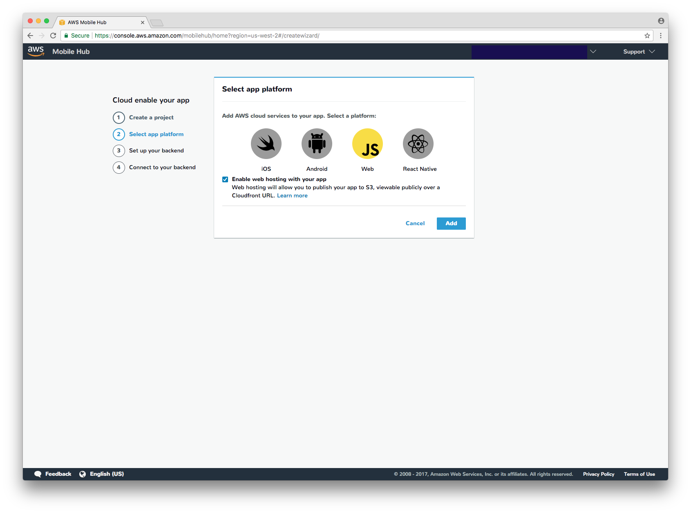
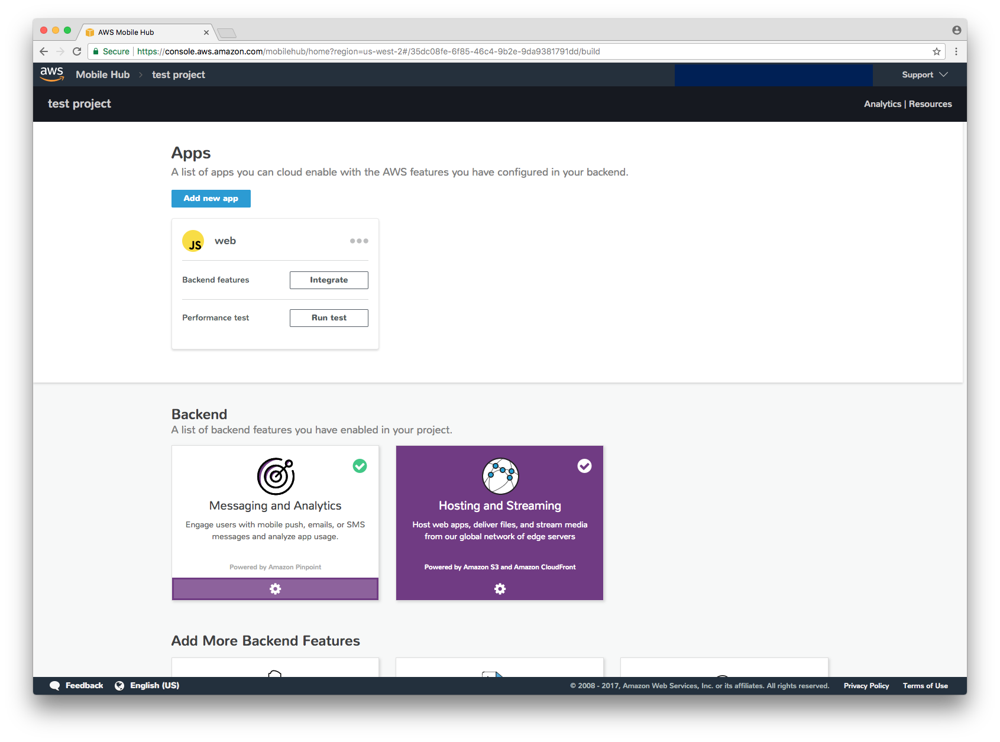

# Mobile Hub Deployment

Mobile Hub is service that makes it extremely easy to deploy static sites with a CloudFront distribution.

To deploy your application using Amazon S3 and Amazon CloudFront, follow these steps:

Sign into the [AWS Mobile Hub console](https://console.aws.amazon.com/mobilehub/home)

Create a project. Make sure to check "Enable web hosting with your app".



Click "Add", "Next", and then "Done".

Click on "Hosting and Streaming"



Take note of the Amazon S3 and Amazon CloudFront URLs.


In `package.json`, you can add a `deploy` command that can be invoked using `npm run deploy`. This is what it would look like based on the above screenshot.

```json
{
  "scripts": {
    "deploy": "aws s3 cp build s3://testproject-hosting-mobilehub-857788232 --recursive"
  }
}
```
