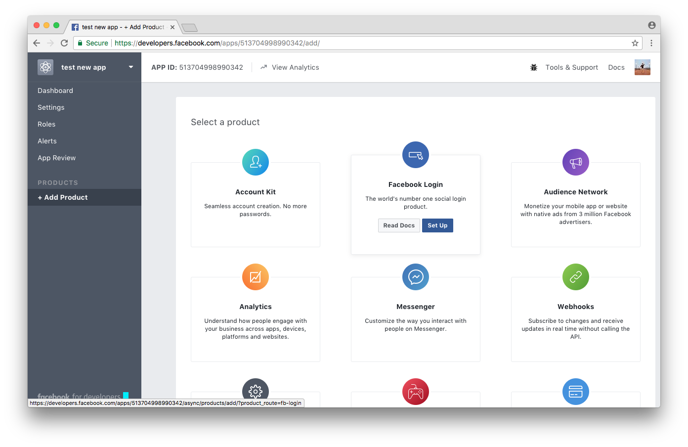
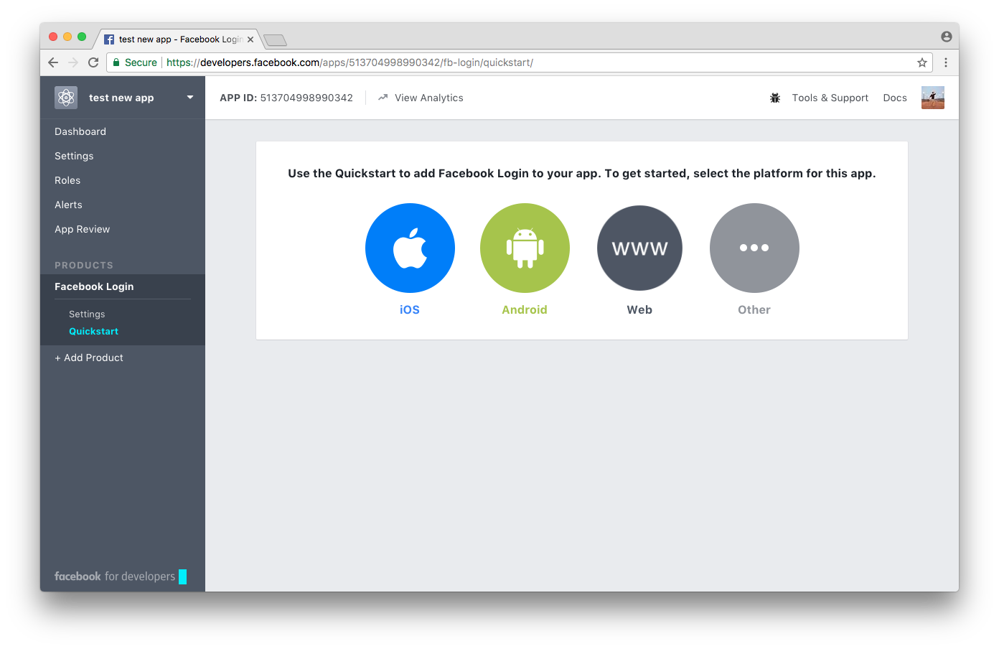
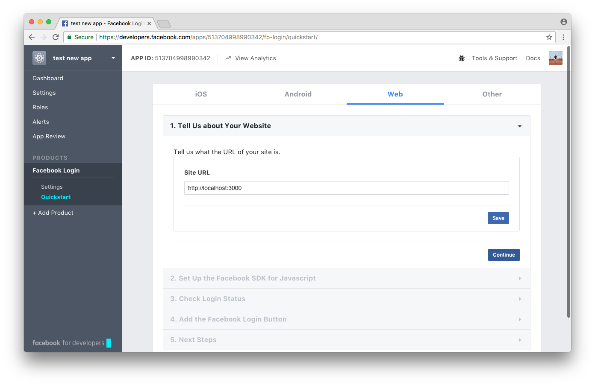
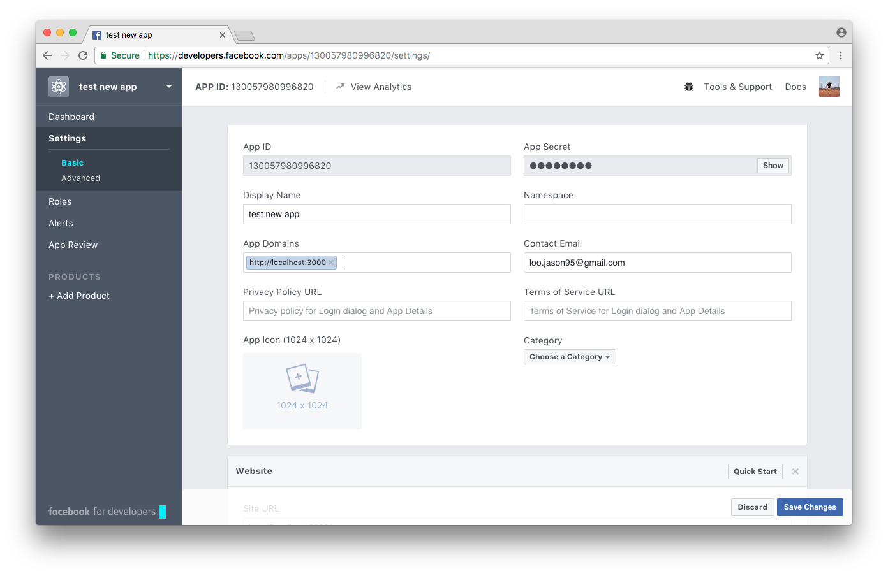
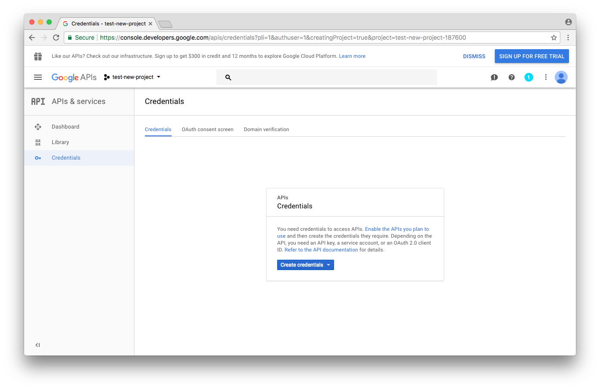

# Social Logins

To enable login with social providers such as Facebook or Google, prior to running `serverless deploy`, make sure to create the appropriate Facebook and Google Apps and modify the values in `api/config.yml`.

## Facebook

Go to [https://developers.facebook.com](https://developers.facebook.com) and create a new app.

From the Add Product screen, click "Set up" for **Facebook Login**

Next, select the "Web" platform.

For the URL of your site, put `http://localhost:3000`

Navigate to the `/apps/{app-id}/settings/basic/` page and set `http://localhost:3000` as an **App Domain**. Click "Save Changes"

Copy the **APP ID** at the top of the page and add it to `api/config.yml` as the `facebook_app_id`. This app id will be deployed the next time you run `serverless deploy`.

## Google

Go to [https://console.developers.google.com](https://console.developers.google.com)

Create a project and go to the "Credentials" tab on the left menu.

Click on "Create Credentials" and then "OAuth client ID"

Select "Web application" as the Application type.

Add `http://localhost:3000` as an "Authorized JavaScript origin.

Click "Create"

Take the generated **Client ID** and add it to `api/config.yml` as the `google_app_id`.
